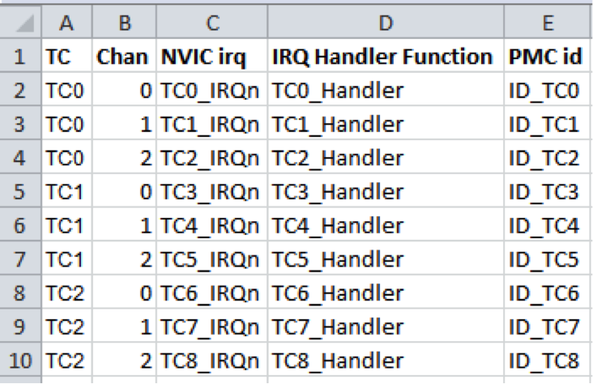
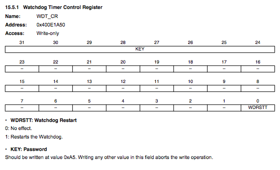
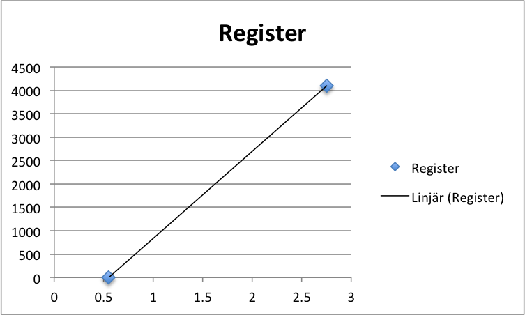

Instruktioner - uppgift 1501f-ht17
======

Programmeringslaboration med interrupt.

_All kod innehåller buggar och som vanligt finns det ingen garanti att koden som finns på labbens repo är felfri. Se det som en del av övningen att korrigera eventuella fel._

_Ulrik Eklund, 2015-12-17_
_Tommy Andersson, 2017-12-08_

Översikt och syfte med uppgiften:
------

I denna uppgift skall du programmera ett system som kan hantera olika saker "samtidigt" med hjälp av interrupt från en Timer Counter. De olika funktionerna ska struktureras i olika c-filer och byggas till ett projekt.

Det färdiga programmet ska generera en sinussignal som skickas ut på D/A-utgången där frekvensen på sinussignalen blir ett resultat av frekvensen på det timer-interrupt som används.  
Parallellt med att generera sinussignalen ska den inbyggda lysdioden på Due-kortet blinka.

**Du kommer inte att hinna göra klart labben om du inte i förväg har börjat fundera på hur det ska gå till och redan har en plan när du kommer till labbsalen.**

Utförande:
----
Uppgiften görs normalt två och två, men det går att jobba ensam också.

Det rekommenderas att ha ett eget USB-minne för katalogerna med din personliga kod även om det inte är helt nödvändigt, all kod du gjort i labben kommer att finnas ”i molnet” när du är klar.

Som vanligt så innehåller all mjukvara buggar, troligtvis även det exempelprojekt som labben utgår ifrån (och till och med denna labbhandledning). Se det som en del av labben att eliminera eventuella existerande buggar om de påträffas!

Krav för godkänt:
------
Ha genomfört följande labbmoment enligt denna handledning:

1.	Skapa ett eget lokalt repo baserat på det gemensamma repot på github classroom som finns för uppgiften.
2.	Starta Atmel Studio, modifiera källkoden i projektet genom att skapa ett timer-baserat interrupt.
3.	Utveckla och inkludera moduler till ett färdigt program som gör flera saker ”samtidigt”.
4.	Kompilera och ladda ner den till utvecklingskortet och köra programmet. 
5. Göra mätningar av skapad signal från D/A-omvandlare , av exekveringstid för interruptrutin och av latency för interruptet. Dessa mätningar redovisas i separat labbrapport på It's learning.
6.	Committa filerna till ditt personliga repo och pusha till ditt github classroom repo.

Deadline enligt info på Its learning, om du lämnar in senare kommer uppgiften att bedömas vid kursdelens slut i januari.

Förberedelser
------
####Instudering

1.	Labben kommer att innehålla grundläggande C-programmering, så repetera vad som gåtts igenom tidigare i kursen och i kursen datateknik från första året. Det finns ett diagnostiskt test på It’s learning. Gör det innan du går till labbsalen som en koll på att du kan grunderna!
2. Studera powerpoint-materialet från föreläsningen om interrupt. 
3.	Läs igenom hela denna handledning innan du går till labbsalen! Stora delar av programmet går att skriva utan att ha tillgång till någon utrustning då en av sakerna är att se till att alla inkluderade filer passar ihop och kan kompileras.

#### Mjuk och hårdvaruförutsättningar för att kunna börja på uppgiften

1.	Om annan dator än labbsalens dator används (t.ex. egen dator) gäller samma förutsättningar som de tidigare uppgifterna 1501a-ht17 och 1501c-ht17.
2.	Alla studenter i labbgruppen måste också ha registrerat en användare på github! 

Själva uppgiften
------
Labben bygger på att sätta samman både nya och tidigare testade c/h-filer till ett fungerande program som gör ett några saker parallellt:

- Blinkar lysdioden med 0,67 Hz (dvs en cykel av tänd/släckt tar 1,5s). Använd de funktioner som du programmerat i första labben; `pinMode()` och `digitalWrite()` tillsammans med `delayMicrosconds()`från den tredje labben.

- Ser till att sköta watchdogen med jämna mellanrum (För att förhindra att programmet låser sig finns det en watchdog som måste "matas" med jämna mellanrum så att processorn inte gör en reset).

- Skriver ett värde på D/A-utgången med ett interrupt med en mycket högre frekvens än lysdiod-cykeln.

Labbsetup
------
Utrustning:

- Utvecklingskort Arduino Due
- Oscilloskop


Labbens programmeringsuppgift
------

Föreslagen arbetsgång (committa gärna när du tycker att det är bra att spara fungerande steg):

1.	Öppna projektet i Atmel Studio i ditt lokala git repo som i tidigare uppgifter

2.	Kopiera in lämpliga delar från tidigare labbar för att få lysdioden att blinka periodiskt
	-  Filerna `digitalIO.h` och `digitalIO.c` från en första labben med funktionerna
	  
	- ```c
	void pinMode(int pinNumber, mode_definition mode);
	void digitalWrite(int pinNumber, int value);
	```
	
	-  Filerna `DelayFunctions.h` och `DelayFunctions.c` (finns redan i projektet) med funktionerna

		```c
	int delayInit(void);
	void delayMicroseconds(uint32_t us);
	```

3. Skriv en funktion som skriver till watchdog-registret, anropa funktionen minst varannan sekund.

4.	Skriv de c/h-filer som initialiserar D/A-omvandlaren.

5.	Skapa nödvändiga filer som initierar en timer-counter och låt den styra ett interrupt med en viss frekvens, för att åstadkomma en sinussignal på oscilloskopet med en viss frekvens.

6. Skriv koden för själva interrupt-handlern.

7. Kör koden på kortet och kontrollera resultatet med oscilloskopet, se dokumentet "Mätningar uppgift 1501f-ht17" på Its learning.

8.	Committa projektet till ditt lokala repo.
 
9.	Pusha till github. 
10. Lämna in på Its Learning


###Saker att tänka på

Det finns ingen garanti att de filer som läraren har inkluderat i git är felfria. Säkrast är ju att använda den kod du själv tagit fram och testat i tidigare labbar.

#### Atmel Software Framework
Använd ASF Wizard för att inkludera nödvändiga filer, t.ex. för D/A-omvandlare, timer counter och seriekommunikation via USB-kabeln.  
Ta också med `#include <asf.h>` i alla filer det behövs.

#### Initialisering av Due-kortet
För att programmet ska exekvera skall följande inkluderas i början på int main(void):

```c
/* Initialize the Arduino Due system */
sysclk_init();
board_init();
```

####Timer-kanaler
Delay-funktionen `delayMicroseconds(int us)` använder TC0. Eftersom Delay och ISR-funktionen använder sig av olika klockor som nollställs vid olika tillfällen kan man inte använda samma till båda!  
Antingen behåller du fördröjningen som den är, med TC0, eller så modifierar du den så att timer-interruptet kan använda sig av TC0. 
 
Oavsett vilken klocka och timer-kanal du använder till vad kan det hjälpa att läsa igenom förklaringen hur klockorna förhåller sig  timer-kanalerna och ISR på <http://ko7m.blogspot.se/2015/01/arduino-due-timers-part-1.html>  
Den viktigaste informationen är följande tabell:


Observera att man måste använda ASF Wizard under ASF menyn för att inkludera Atmels bibliotek för timern (TC) för att dessa ska fungera.


#### Timer-baserat interrupt

Skriv c/h-filer för en ISR som skriver ett värde på D/A-utgången baserat på en array.
 
Om du använder timer counter 0 för avbrottet är det en funktion `void TC0_Handler(void)`. Om du använder en annan timer-kanal måste du använda en annat namn på funktionen. _Atmel studio håller automatiskt reda på att funktionen med namnet `TC0_Handler()`är ISR för timer counter 0._

#### Generera en sinusvåg

Nedan finns en tabell med 16 element, som är en diskretisering av en hel period av en sinusvåg med amplituden 1 runt 0. Den kan ligga till grund för att generera en sinusvåg. Enklast är att skapa en array där varje element baseras på denna tabell, fast skalat till rätt amplitud och medelvärde.

index | x [rad] | sin(x)
--- | ---| ---
0 | 0 | 0,000
1 | 0,125 | 0,383
2 | 0,25 | 0,707
3 | 0,375 | 0,924
4 | 0,5 | 1,000
5 | 0,625 | 0,924
6 | 0,75 | 0,707
7 | 0,875 | 0,383
8 | 1 | 0,000
9 | 1,125 | -0,383
10 | 1,25 | -0,707
11 | 1,375 | -0,924
12 | 1,5 | -1,000
13 | 1,625 | -0,924
14 | 1,75 | -0,707
15 | 1,875 | -0,383

Om man har ett interrupt som skriver ut nästa värde från arrayen varje gång ett timer-baserat interrupt exekveras så kommer det att bli en sinusformad signal på A/D-utgången med frekvensen 1/16 av interruptets frekvens. Efter index 15 så börjar man förstås om på index 0.

Du skall generera en sinusvåg där frekvensen ges av de sex första siffrorna i ditt personnummer enligt följande formel:

```c
freq = (persNumber % 1999) + 991;****
```

Är du alltså född 850808 får du frekvensen _2224 Hz._

Du kan enkelt räkna ut hur ofta du måste anropa interrupt-handlern för att få rätt frekvens. Vektorn innehåller ju 16 värden för en hel svängning.

Är ni två studenter som jobbar ihop använder ni  ett av era personnummer. Namnet på den studenten anges som kommentar i koden!

#### D/A-utgången 

Låt utsignalen variera runt 1,5 V på A/D-utgången med en amplitud på 0,5V, det innebär att utspänningen variera mellan 1,0 och 2,0 V  
(se appendix).  


**Tänk också på att D/A-omvandlaren har ett arbetsområde som ges av _Table 45-44. Analog Outputs_ i databladet för SAM3X8E!** 0 respektive maxvärdet till registret på D/A omvandlaren ger alltså _inte_ 0V respektive 3,3V ut. Se även appendix.
 
Välj själv hur du vill beräkna värdet till D/A-omvandlaren i interruptet. Det kan t.ex. göras med flyttal i ISR eller så gör du beräkningarna innan du skriver kod så att all kod använder sig enbart av heltal.

Den första lösningen är ju enklare att förstå om någon läser koden, men den andra går ju mycket snabbare.
Du skriver värdet till D/A-omvandlaren med hjälp av `dacc_write_conversion_data(uint32_t)`.



### Power management av externa devices

Både D/A-omvandlaren och timern går på en extern klocka jämfört med processorns huvudklocka. SAM3X8e aktiverar dessa bara då man säger till för att inte använda mer energi än nödvändigt, därför måste respektive klocka aktiveras när man ska programmet:

```c
pmc_enable_periph_clk(ID_TC0); /*Enable timer clock 0 */
pmc_enable_periph_clk(ID_DACC); /* Enable DA converter clock */
```


### Watchdog timer (WDT)

Följande är hämtat från databladet för SAM3X8E:

> The Watchdog Timer (WDT) can be used to prevent system lock-up if the software becomes trapped in a deadlock. It restarts with initial values on processor reset.   
> After a Processor Reset, the value of WDV is 0xFFF, corresponding to the maximum value of the counter with the external reset generation enabled. **This means that a default Watchdog is running at reset, i.e., at power-up.** The user must either disable it if he does not expect to use it or must reprogram it to meet the maximum Watchdog period the application requires.   
> In normal operation, the user reloads the Watchdog at regular intervals before the timer underflow occurs, by writing the Control Register.

I klartext betyder det att om man inte gör något åt det så kommer processorn att göra en reset efter ett tag då WDT har räknat ner till noll. 



Skriv c/h-filer innehållande en funktion

```c
int watchdogReload(void);
```
som startar om watchdog-timern genom att skriva rätt värde till `WDT_CR`. Tänk på att du måste skriva till bitarna `KEY` och `WDRSTT`samtidigt!  
`watchdogReload()` kan sen anropas periodiskt, t.ex. från en loop i main.

#### Utskrift

Vill man skriva ut något på konsolen via USB-kabeln måste den initieras. Kod finns i git

```c
/* Initialize the console UART used from within Atmel Studio*/
configure_console();
```

Tänk också på att du måste konfigurera rätt parametrar i `src/config/conf_uart_serial.h` för att kommunicera med terminalfönstret, enklast är att ta bort kommentarstecknen för tre rader.


## Utföra mätningar med oscilloskop
Följ anvisningar i word-dokumentet "Mätningar - uppgift 1501f-ht17.



Inlämning på github och It's learning
------

Som i uppgift 1501a-ht17.

**Glöm inte att ange namnen alla som bidragit med att göra klart uppgiften!** Det går inte att komma i efterhand och påstå att du varit med om ditt namn inte finns med på originalinlämningen! 


Appendix - Initiering av digital-to-analog converter
======

```c
int daccInit()
{
	int allOK = 1;
	pmc_enable_periph_clk(ID_DACC); /* DACC clock should be enabled before using it. */
	dacc_reset(DACC); /* Reset DACC */
	dacc_set_transfer_mode(DACC, 0); /* Configure FIFO transfer mode */
	dacc_set_timing(DACC,1,1,0); /* 1 is shortest refresh period, 1 max. speed, 0 startup time */
	dacc_set_channel_selection(DACC,0); /* Disable flexible (TAG) mode and select channel 0 for DAC output */
	allOK = dacc_enable_channel(DACC, 0); /* Enable DAC channel 0 */
	return allOK;
}
```

Om man råkar ha fått ett Due-kort där kanal 0 inte fungerar får man ändra lite i ovanstående kod...
Efter initialiseringen så kan man ändra utspänningen med ett enda funktionsanrop i ASF:

```c
uint32_t value;
dacc_write_conversion_data(DACC, value);
```


Appendix - Rätt spänning på D/A-utgången
======
D/A-omvandlaren har ett arbetsområde mellan `(1/6)*V_ADVREF`och `(5/6)*V_ADVREF`. Med 12 bitars upplösning så innebär det att skriver man `0x00000000` till registret får man ut den lägre spänningen och skriver man `0x00000FFF` (= 4095 decimalt) får man den högre spänningen. Däremellan är det ett linjärt samband.

Då är det rätt lätt att hitta en formel av typen `Reg = k*V + b` för att bestämma vilket registervärde (Reg) som behövs för att ge en viss spänning (V).


Eftersom man vet spännings- och registervärdet för två punkter, (V0,Reg0) respektive (V1,Reg1), är det lätt att räkna ut k och b (grundläggande matte!)

`k = (Reg1-Reg0)/(V1-V0)`

`b = Reg0 - k*V0`

